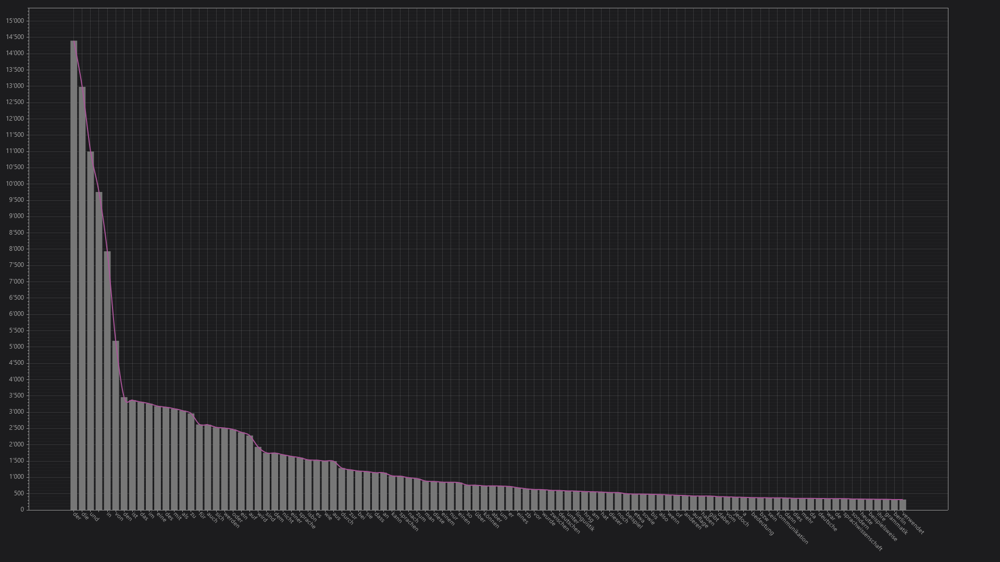

# WikiWordPlotter

You can use this to automaticly scrape the german wikipedia and then plot the frequency of the words. You can choose how many sites will be checked.

Here is a Plot which i have done with 200 websites scraped

